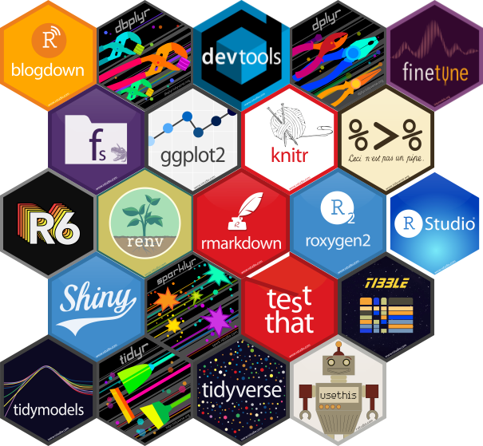

```{r setup, include=FALSE}
knitr::opts_chunk$set(echo = TRUE)
```

# Mapping in R

```{r Load_Libraries,echo=FALSE,warning=FALSE,message=FALSE}
library(leaflet)
```


# This shows the map of a certain location

```{r Maps,echo=FALSE,warning=FALSE,message=FALSE}
leaflet() %>% 
  addTiles() %>% 
  addMarkers(lng = 7.376,lat = 5.230)
```


# R Markdown provides a unified authoring framework for datascience, combining your code, its results, and your prose commentary.


# R markdown documents are fully reproducible and support dozens of output formats, like pdf, word files, slideshows and more.

# R markdown files is designed to be used in three ways

## For communicating to decision makers who want to focus on the conclusions, not the code behind the analysis.

## For collaborating with other data scientists (including future you!) who are interested in both your conclusions, and how you reach them (i.e., the code)

## As an environment in which to do data science, as a modern day  lab notebook where you can capture not only what you did, but also what you were thinking.

# THE D DMDM,D,


### Text Formatting in R Markdown   ######

# Italics (Two single) or underscore)

 Hello R, *This* is _an_ Hello world file.


# Bold (Double or underscore)

 Hello R, **This** is __an__ Hello world file.


##### Headings    ####
# This is level one header

## This is level two headers


#### Bulleted list   ####
* This is the first bullet
- This is also the first bullet
- This is the second bullet

### Link and Images
[the link to my blog can be found **here**](http:www.google.com)

# Let me import the image





## Tables
| Sepal.Length| Sepal.Width| Petal.Length| Petal.Width|Species |
|------------:|-----------:|------------:|-----------:|:-------|
|          5.1|         3.5|          1.4|         0.2|setosa  |
|          4.9|         3.0|          1.4|         0.2|setosa  |
|          4.7|         3.2|          1.3|         0.2|setosa  |
|          4.6|         3.1|          1.5|         0.2|setosa  |
|          5.0|         3.6|          1.4|         0.2|setosa  |
|          5.4|         3.9|          1.7|         0.4|setosa  |

## Inline reference
`r nrow(iris)`

## Chunk Options

- eval: TRUE or FALSE 
- include: 
- echo: TRUE or FALSE
- message: TRUE or FALSE
- warnings: TRUE or FALSE
- results: TRUE
- error: TRUE

```{r Example,echo=FALSE,warning=FALSE,message=FALSE,fig.width=12,fig.height=8}
library(ggplot2)
ggplot(data = iris,aes(x = Sepal.Length,y = Sepal.Width,col=Species))+geom_point()

```

