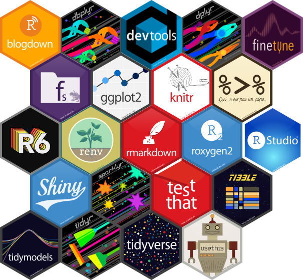
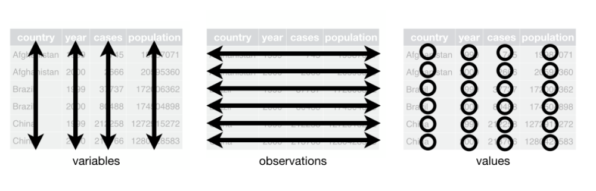
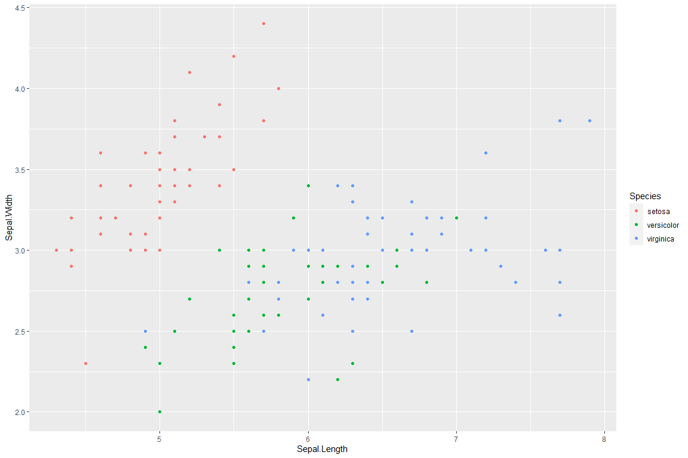

# Mapping in R


# This shows the map of a certain location


```{=html}
<div id="htmlwidget-18401e774a3acefe5290" style="width:672px;height:480px;" class="leaflet html-widget"></div>
<script type="application/json" data-for="htmlwidget-18401e774a3acefe5290">{"x":{"options":{"crs":{"crsClass":"L.CRS.EPSG3857","code":null,"proj4def":null,"projectedBounds":null,"options":{}}},"calls":[{"method":"addTiles","args":["//{s}.tile.openstreetmap.org/{z}/{x}/{y}.png",null,null,{"minZoom":0,"maxZoom":18,"tileSize":256,"subdomains":"abc","errorTileUrl":"","tms":false,"noWrap":false,"zoomOffset":0,"zoomReverse":false,"opacity":1,"zIndex":1,"detectRetina":false,"attribution":"&copy; <a href=\"http://openstreetmap.org\">OpenStreetMap<\/a> contributors, <a href=\"http://creativecommons.org/licenses/by-sa/2.0/\">CC-BY-SA<\/a>"}]},{"method":"addMarkers","args":[5.23,7.376,null,null,null,{"interactive":true,"draggable":false,"keyboard":true,"title":"","alt":"","zIndexOffset":0,"opacity":1,"riseOnHover":false,"riseOffset":250},null,null,null,null,null,{"interactive":false,"permanent":false,"direction":"auto","opacity":1,"offset":[0,0],"textsize":"10px","textOnly":false,"className":"","sticky":true},null]}],"limits":{"lat":[5.23,5.23],"lng":[7.376,7.376]}},"evals":[],"jsHooks":[]}</script>
```


# R Markdown provides a unified authoring framework for datascience, combining your code, its results, and your prose commentary.


# R markdown documents are fully reproducible and support dozens of output formats, like pdf, word files, slideshows and more.

# R markdown files is designed to be used in three ways

## For communicating to decision makers who want to focus on the conclusions, not the code behind the analysis.

## For collaborating with other data scientists (including future you!) who are interested in both your conclusions, and how you reach them (i.e., the code)

## As an environment in which to do data science, as a modern day  lab notebook where you can capture not only what you did, but also what you were thinking.

# THE D DMDM,D,


### Text Formatting in R Markdown   ######

# Italics (Two single) or underscore)

 Hello R, *This* is _an_ Hello world file.


# Bold (Double or underscore)

 Hello R, **This** is __an__ Hello world file.


##### Headings    ####
# This is level one header

## This is level two headers


#### Bulleted list   ####
* This is the first bullet
- This is also the first bullet
- This is the second bullet

### Link and Images
[the link to my blog can be found **here**](http:www.google.com)

# Let me import the image







## Tables
| Sepal.Length| Sepal.Width| Petal.Length| Petal.Width|Species |
|------------:|-----------:|------------:|-----------:|:-------|
|          5.1|         3.5|          1.4|         0.2|setosa  |
|          4.9|         3.0|          1.4|         0.2|setosa  |
|          4.7|         3.2|          1.3|         0.2|setosa  |
|          4.6|         3.1|          1.5|         0.2|setosa  |
|          5.0|         3.6|          1.4|         0.2|setosa  |
|          5.4|         3.9|          1.7|         0.4|setosa  |

## Inline reference
150

## Chunk Options

- eval: TRUE or FALSE 
- include: 
- echo: TRUE or FALSE
- message: TRUE or FALSE
- warnings: TRUE or FALSE
- results: TRUE
- error: TRUE

<!-- -->


```r
ggplot(data=iris,aes(x=Sepal.Length,y=Sepal.Width))+
  geom_point(
```

